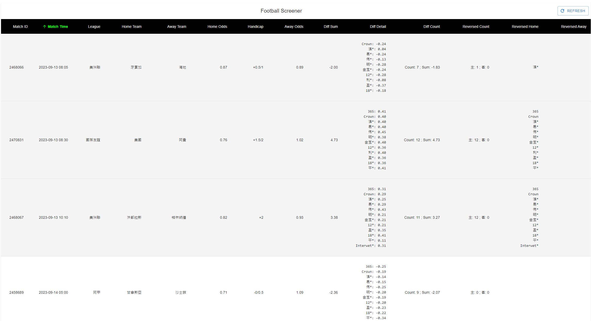

## Football Screener

A website to analyse the odds differences between HKJC and other bookmakers


### Techniques

- SocketIO (React + Python)
- Flask
- Web Scraping
- Heroku Dynos
- Data Science
- Amazon S3
- React 18 with Typescript
- Material UI

### Getting Started

#### Prerequisite:

Create your own s3_connection.env in ./config:

```
S3_REGION=
S3_ENDPOINT=
S3_ACCESS_KEY=
S3_SECRET_KEY=
```

##### Localhost

```
Server:
1. python server.py

Frontend:
1. cd frontend
2. npm install
3. npm start
```

##### Heroku Dynos

```
1. cd frontend
2. npm install
3. npm run build
4. Upload project to a git repository
5. Connect the git repository to Heroku App
```
